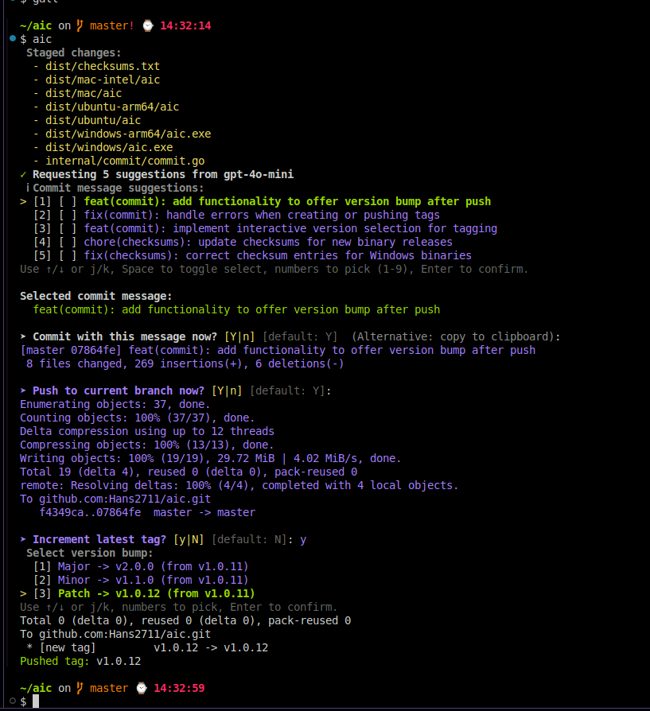

# aic

AI‑assisted git commit message generator with an iterative “combine” workflow, an AI‑powered “analyze” command that learns your repo’s style presets, and first‑class OpenAI, Claude, Gemini, and custom server support.



## Quick Start

```bash
# choose a provider (auto‑detected if set)
export OPENAI_API_KEY=sk-...   # or: export CLAUDE_API_KEY=sk-... or: export GEMINI_API_KEY=sk-...

# optional: infer this repo's commit style and save .aic.json (used as presets)
aic analyze

# generate commit messages for staged changes
aic

# optional: guide the model
aic -s "Focus on auth refactor and migrations"

# CI mode (no prompts) and auto‑commit
AIC_NON_INTERACTIVE=1 AIC_AUTO_COMMIT=1 aic

# Git Hook
git commit -m aic
```

## Highlights

- Recursive combine: multi‑select suggestions, press Enter to synthesize better options, repeat to refine.
- Multiple providers: `openai`, `claude`, `gemini` (auto‑detect; priority openai > claude > gemini), or `custom`.
- Sensible defaults: OpenAI `gpt-4o-mini`, Claude `claude-3-sonnet-20240229`, Gemini `gemini-1.5-flash` (override with `AIC_MODEL`).
- Friendly TUI: 1–9/0 to choose, arrows or j/k to navigate, Space to multi‑select.
- CI‑ready: non‑interactive mode and optional auto‑commit.
- Large diffs: structured summary plus clearly truncated raw diff with cutoff notes.
- Mock mode: `AIC_MOCK=1` for deterministic, offline suggestions.
- AI‑powered analyze: learns your repo’s style from `git log` and writes a repo `.aic.json` `instructions` used for future commits (merged with home `~/.aic.json` and `-s`).

<details>
<summary><strong>Install</strong></summary>

Clone, verify, and install (no build required):

```bash
git clone https://github.com/Hans2711/aic.git
cd aic
./scripts/verify.sh
sudo bash scripts/install.sh   # /usr/local/bin/aic -> dist/<platform>/aic
aic --version
```

If `/usr/local/bin` is unavailable, the installer falls back to `~/.local/bin/aic`. Ensure it’s on `PATH`:

```bash
export PATH="$HOME/.local/bin:$PATH"; hash -r
```

macOS Gatekeeper (if needed):

```bash
xattr -d com.apple.quarantine /usr/local/bin/aic 2>/dev/null || true
```

</details>

<details>
<summary><strong>Analyze</strong></summary>

Use AI to infer your repository’s commit message conventions and save them as repo‑local presets.

Usage:

```bash
aic analyze [--limit N]   # default N=1000 recent subjects
```

What it does:

- Reads recent non‑merge commit subjects and asks your configured provider to synthesize concise style instructions.
- Writes/updates `<repo>/.aic.json` with an `instructions` string.
- These repo instructions are merged with home `~/.aic.json` and CLI `-s` in this order: repo → home → CLI.

Notes:

- Requires a provider API key (OpenAI, Claude, Gemini, or Custom) set in the environment.
- Only commit subjects are sent (no bodies) to minimize prompt size.
- You can tweak `.aic.json` manually after generation.

</details>

<details>
<summary><strong>Team Presets (~/.aic.json)</strong></summary>

Share a common commit style across your team via a simple JSON file placed in each developer’s home directory:

File: `~/.aic.json`

```json
{
  "instructions": "Use imperative mood, keep <=72 chars, prefer feat|fix|docs|refactor scopes, no trailing period."
}
```

If set, `instructions` is appended to the AI system prompt for both the initial suggestions and the combine step. You can still add ad‑hoc guidance with `-s "..."`; both are merged (repo first, then home, then CLI).

Notes:

- The file is optional; if missing or invalid, `aic` continues with defaults.
- Only the `instructions` key is read today; more keys may be supported later.

</details>

<details>
<summary><strong>Windows</strong></summary>

Option 1: Download a prebuilt binary

- Grab `aic_windows_amd64.zip` (or `aic_windows_arm64.zip`) from the latest GitHub Release.
- Unzip and place `aic.exe` somewhere on your `PATH` (e.g., `C:\Users\<you>\bin`).
- Ensure Git for Windows is installed and available in `PATH`.

Option 2: Build from source with Go

```powershell
git clone https://github.com/Hans2711/aic.git
cd aic
go build -o aic.exe ./cmd/aic
```

Verify:

```powershell
PS> .\aic.exe --version
```

Notes:

- The interactive UI falls back gracefully on Windows if advanced TTY features aren’t available.
- Clipboard copy uses `clip` when present (bundled with modern Windows).

</details>

<details>
<summary><strong>Linux AppImage</strong></summary>

Build AppImage artifacts locally (requires Linux):

```bash
# 1) Build binaries
bash scripts/build.sh

# 2) Package AppImage (downloads appimagetool automatically)
bash scripts/package_appimage.sh

# Outputs:
#   dist/aic_linux_amd64.AppImage
#   dist/aic_linux_arm64.AppImage

# Run the AppImage
chmod +x dist/aic_linux_amd64.AppImage
./dist/aic_linux_amd64.AppImage --version
```

Notes:

- The AppImage contains a static Go binary (CGO disabled), so it runs on most modern distros.
- The AppImage is CLI‑oriented (Terminal=true); it launches `aic` in your terminal.
- The packager uses APPIMAGE_EXTRACT_AND_RUN=1 to avoid a FUSE requirement.

</details>

<details>
<summary><strong>Usage</strong></summary>

```bash
aic [-s "extra instruction"] [--version] [--no-color]
aic analyze [--limit N]   # infer repo style and write .aic.json
```

Interactive controls:

- 1–9/0 choose, ↑/↓ navigate, Space multi‑select, Enter combine.

Disable ANSI colors:

```bash
aic --no-color
# or
export AIC_NO_COLOR=1; aic
```

</details>

<details>
<summary><strong>Git Hook</strong></summary>

Install a `prepare-commit-msg` hook so `aic` suggests a message on `git commit`:

```bash
bash scripts/install_git_hook.sh
```

Behavior:

- Runs for normal commits without `-m/-F` and not for merges/squashes/amends.
- If the commit message file already has content, it leaves it unchanged.
- Writes the selected message into the commit message buffer so you can still edit.

Shortcut:

- Type `git commit -m "aic"` to trigger generation explicitly (the hook replaces the placeholder).

Notes:

- Ensure `aic` is on your `PATH`.
- Temporarily skip the hook with `AIC_SKIP_HOOK=1 git commit`.

</details>

<details>
<summary><strong>Configuration</strong></summary>

 Providers and models:

 - `AIC_PROVIDER`: `openai` | `claude` | `gemini` | `custom` (auto‑detect from API keys; priority openai > claude > gemini).
 - `OPENAI_API_KEY` / `CLAUDE_API_KEY` / `GEMINI_API_KEY`: required for chosen provider.
 - `CUSTOM_API_KEY`: optional; only if your custom server requires it.
 - `AIC_MODEL`: override default model (OpenAI: `gpt-4o-mini`; Claude: `claude-3-sonnet-20240229`; Gemini: `gemini-1.5-flash`; Custom: set to a model exposed by your server).

Generation & UX:

- `AIC_SUGGESTIONS`: number of suggestions (1–10, default 5; non-interactive default: 1).
- `AIC_NO_COLOR`: disable colors (same as `--no-color`).
- `-s "..."`: extra instruction appended to the prompt.

Run modes:

- `AIC_NON_INTERACTIVE=1`: pick first suggestion and print (CI).
- `AIC_AUTO_COMMIT=1`: with non‑interactive, also run `git commit -m ...`.
- `AIC_MOCK=1`: offline, deterministic suggestions (no API calls).

Debug:

- `AIC_DEBUG=1`: verbose debug details, including large‑diff summarization info and content.

Large diffs:

- For very large staged diffs, the tool generates a compact “Diff Summary” (using the provider’s default model) and appends a clearly truncated raw diff (~16k chars) with cutoff notes. If summarization fails, it falls back to simple truncation.

</details>

<details>
<summary><strong>Custom Server (OpenAI‑compatible)</strong></summary>

Use `AIC_PROVIDER=custom` to send requests to a local or remote OpenAI‑compatible server (e.g., LM Studio at `http://127.0.0.1:1234`). If `AIC_MODEL` is unset or set to `auto`, `aic` queries `/v1/models` and picks the first model.

Defaults (override via env):

- `CUSTOM_BASE_URL` = `http://127.0.0.1:1234`
- `CUSTOM_CHAT_COMPLETIONS_PATH` = `/v1/chat/completions`
- `CUSTOM_COMPLETIONS_PATH` = `/v1/completions`
- `CUSTOM_EMBEDDINGS_PATH` = `/v1/embeddings`
- `CUSTOM_MODELS_PATH` = `/v1/models`
- `CUSTOM_API_KEY` = optional; if set, sent as `Authorization: Bearer <key>`

Examples (LM Studio):

```bash
# Auto-pick model from /v1/models
AIC_PROVIDER=custom CUSTOM_BASE_URL=http://127.0.0.1:1234 aic

# Or specify a model explicitly
AIC_PROVIDER=custom CUSTOM_BASE_URL=http://127.0.0.1:1234 AIC_MODEL="<model-id>" aic
```

Tip: run `curl http://127.0.0.1:1234/v1/models` to inspect model IDs.

</details>

<details>
<summary><strong>Gemini Notes</strong></summary>

- Models: commonly available options include `gemini-1.5-flash` (default) and `gemini-1.5-pro`. Newer `gemini-2.5-*` models may require allowlisted access.
- Auto‑detect: setting `GEMINI_API_KEY` is enough; or force with `AIC_PROVIDER=gemini`.
- Output budget: if Gemini returns empty content with `finishReason=MAX_TOKENS`, `aic` automatically retries with a larger output token budget. You can also set `AIC_SUGGESTIONS=1` or choose a smaller model (e.g., `gemini-1.5-flash`).

Example:

```bash
export GEMINI_API_KEY=sk-...
AIC_PROVIDER=gemini AIC_MODEL=gemini-1.5-flash aic
```

</details>

<details>
<summary><strong>Testing</strong></summary>

Mock (fast, offline):

```bash
AIC_MOCK=1 ./scripts/test_openai_models.sh
```

OpenAI API (consumes tokens):

```bash
export OPENAI_API_KEY=sk-...
./scripts/test_openai_models.sh
MODELS="gpt-4o-mini gpt-4o" ./scripts/test_openai_models.sh
```

Claude API:

```bash
export CLAUDE_API_KEY=sk-...
./scripts/test_claude_models.sh
```

Gemini API:

```bash
export GEMINI_API_KEY=sk-...
./scripts/test_gemini_models.sh
```

Large diff summarization (~50KB synthetic diff):

```bash
bash scripts/test_large_diff.sh                 # mock
export OPENAI_API_KEY=sk-...; REAL=1 bash scripts/test_large_diff.sh
```

Enable extra debug during summary:

```bash
export AIC_DEBUG=1
```

</details>
